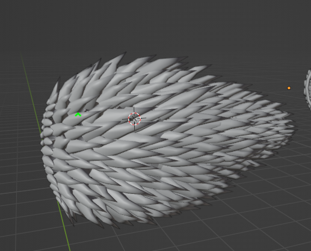

# Hi, I'm Dylan Wang,

Welcome Ms. Kim or other to my student profile for the 2025-2026 ICS4U school year. This is where I will be posting most of my projects, reflections, and assets. If you have any questions or concerns, you may contact me. 

## About me
My name is Dylan, I'm a student enrolled in the ICS4U high school course. I have next to no experience when it comes to coding, but I have advanced level 3D graphics experience with modeling through various applications. 
I am taking ICS4U computer science to ensure that I keep my options open when it comes to various software engineering and coding related future career or education possibilities. 

## EXAMPLE OF MY BLENDER WORK 
1. Spiked sea creature, basic low-poly model used for game development. 

## Highlights
- 🔧 Project 1: *(title)* – *(1–2 lines about what it does)*
- 🧠 Concept I learned: *(short note)*
- 📝 Blog/Reflection: [Reflection #1](./posts/first_reflection.md)

---
